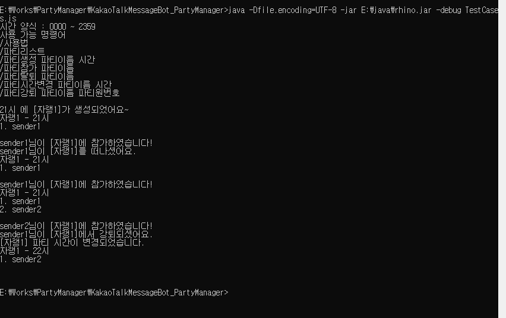

# KakaoTalkMessageBot_PartyManager
  
메신저 앱에서 사용하는 파일 : PartyManager.js  
윈도우에서 테스트하기 위한 파일 : TestCases.js  
  
PartyManager.js 상단에 설정 값들을 각자 상황에 맞게 수정하여 사용.  
  
시간 양식 : 0000 ~ 2359  
  
# 사용 가능 명령어들
- /사용법
- /파티리스트
- /파티생성 파티이름 시간
- /파티참가 파티이름
- /파티탈퇴 파티이름
- /파티시간변경 파티이름 시간
- /파티강퇴 파티이름 파티원번호
  

# 특징
- 매일 AlarmTime에 들어있는 값의 정시에 알람. (파티가 있을 경우)
- GameTypes에 있는 것들만 파티 생성 가능. 숫자는 파티 정원.
- KakaoNameSplitCharacters의 문자로 split 함. (ex. ZeroBoom/28/성남 -> ZeroBoom으로 파싱, ZeroBoom 28 성남 -> ZeroBoom으로 파싱)
  
*****
# 윈도우에서 테스트하기
- jdk 및 rhino.jar 필요.
- Command Line에서 java -Dfile.encoding=UTF-8 -jar rhino.jar -debug TestCases.js
  
